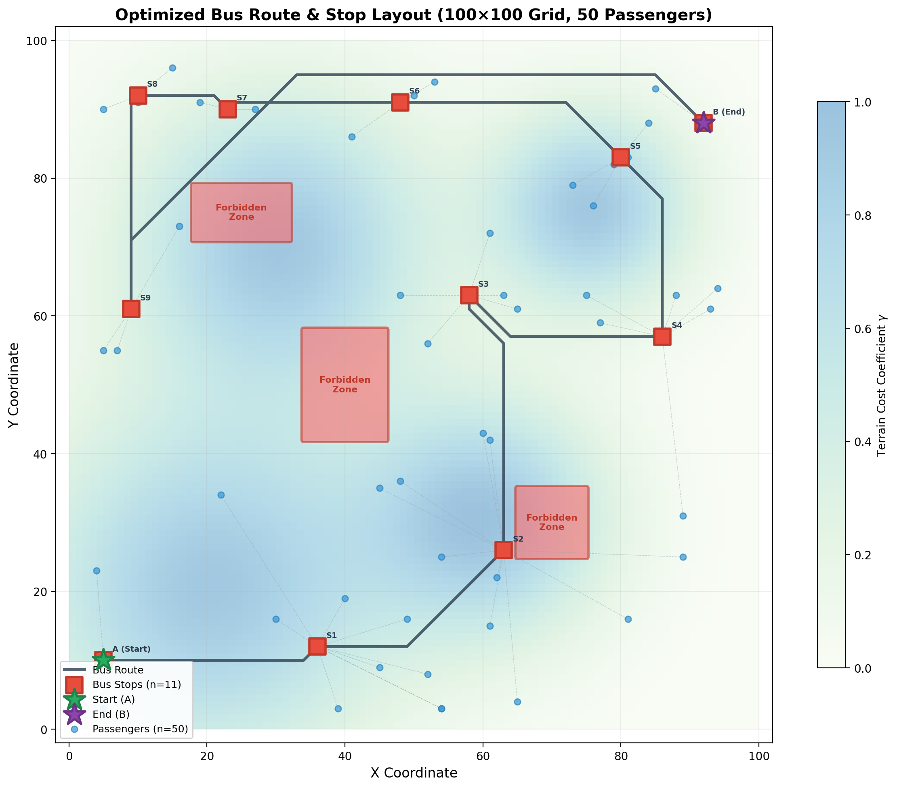
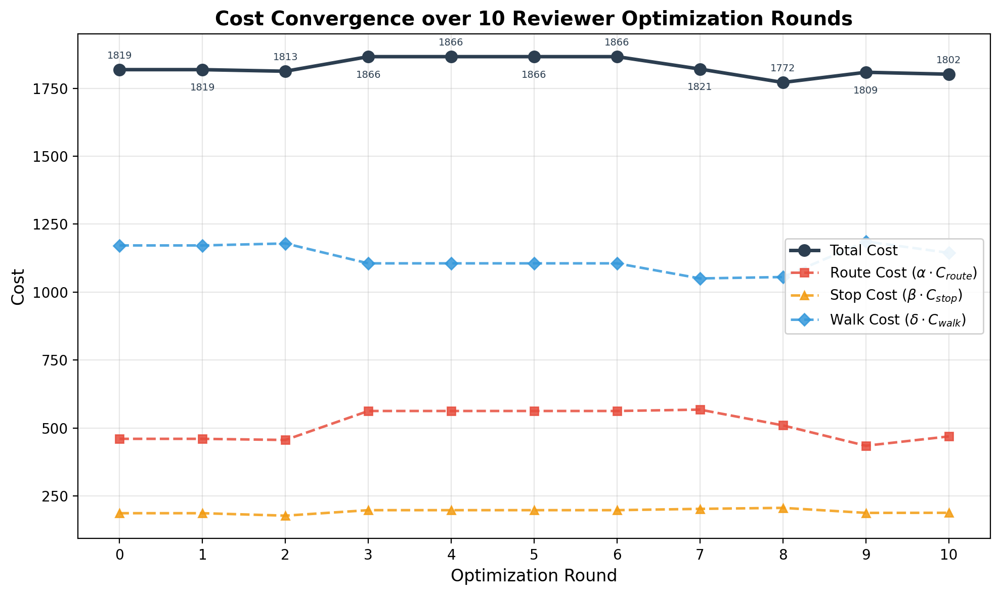

# 城市公車路線與站點設置規劃：技術報告

> **AI 交通規劃顧問團隊**
> 作業研究專家 · 演算法工程師 · 系統架構師

---

## Phase 1: 數學與演算法建模

### 1.1 環境表示法

我們將城市建模為一個加權有向圖 $G = (V, E)$：

**節點集合 $V$：**

- $V = V_R \cup V_F$，其中 $V_R$ 為可通行節點，$V_F$ 為禁區節點
- 特殊節點：起點 $s \in V_R$（地點 A）、終點 $t \in V_R$（地點 B）
- 每個節點 $v \in V_R$ 具有屬性：
  - 地形成本係數 $\gamma_v \geq 0$（反映當地地形對站牌建設的加成）
  - 座標 $(x_v, y_v)$（用於計算步行距離）

**邊集合 $E$：**

- $E = \{(u, v) \mid u, v \in V_R, \text{存在可通行道路連接}\}$
- 每條邊 $(u,v) \in E$ 具有：
  - 行駛成本（距離）$d_{uv} > 0$
  - 通行性標記：若 $u \in V_F$ 或 $v \in V_F$，則該邊不可使用

**乘客集合：**

- $P = \{p_1, p_2, \dots, p_n\}$，每位乘客 $p_i$ 位於座標 $(x_{p_i}, y_{p_i})$
- 乘客 $p_i$ 到節點 $v$ 的步行距離定義為 $w_{iv} = \|p_i - v\|_2$（歐幾里得距離，或路網步行距離）

### 1.2 決策變數

| 變數      | 定義                                 | 型態              |
| --------- | ------------------------------------ | ----------------- |
| $x_{uv}$  | 邊 $(u,v)$ 是否被選入公車路線        | Binary $\{0,1\}$  |
| $y_v$     | 節點 $v$ 是否設置站牌               | Binary $\{0,1\}$  |
| $z_{iv}$  | 乘客 $p_i$ 是否被分配到站點 $v$     | Binary $\{0,1\}$  |

### 1.3 目標函數

$$
\min \quad \underbrace{\alpha \sum_{(u,v) \in E} d_{uv} \cdot x_{uv}}_{\text{路線行進成本}} + \underbrace{\beta \sum_{v \in V_R} (C_{\text{fixed}} + C_{\text{terrain}} \cdot \gamma_v) \cdot y_v}_{\text{站牌建設營運成本}} + \underbrace{\delta \sum_{i=1}^{n} \sum_{v \in V_R} w_{iv} \cdot z_{iv}}_{\text{乘客步行成本}}
$$

其中：

- $\alpha, \beta, \delta > 0$ 為三項成本的權重
- $C_{\text{fixed}}$ 為每站固定建設成本
- $C_{\text{terrain}}$ 為地形加成的單位成本
- $\gamma_v$ 為節點 $v$ 的地形係數

### 1.4 限制條件

**(C1) 路徑連通性——流量守恆 (Flow Conservation)**

路線必須形成一條從 $s$ 到 $t$ 的連通路徑。引入流量變數 $f_{uv} \geq 0$：

$$
\sum_{(s,v) \in E} f_{sv} - \sum_{(v,s) \in E} f_{vs} = 1 \quad \text{(源點流出)}
$$

$$
\sum_{(v,t) \in E} f_{vt} - \sum_{(t,v) \in E} f_{tv} = -1 \quad \text{(匯點流入)}
$$

$$
\sum_{(u,v) \in E} f_{uv} - \sum_{(v,w) \in E} f_{vw} = 0, \quad \forall v \in V_R \setminus \{s, t\} \quad \text{(中間節點守恆)}
$$

$$
f_{uv} \leq x_{uv}, \quad \forall (u,v) \in E
$$

**(C2) 禁區限制**

$$
x_{uv} = 0, \quad \forall (u,v) \in E \text{ s.t. } u \in V_F \text{ or } v \in V_F
$$

**(C3) 站牌僅設於路線上**

$$
y_v \leq \sum_{(u,v) \in E} x_{uv} + \sum_{(v,w) \in E} x_{vw}, \quad \forall v \in V_R
$$

此限制確保站牌只能設在路線經過的節點上。

**(C4) 最大站牌數量限制**

$$
\sum_{v \in V_R} y_v \leq K_{\max}
$$

**(C5) 乘客分配——每位乘客恰好分配至一個站點**

$$
\sum_{v \in V_R} z_{iv} = 1, \quad \forall i \in \{1, \dots, n\}
$$

**(C6) 乘客只能分配到已設站牌的站點**

$$
z_{iv} \leq y_v, \quad \forall i \in \{1, \dots, n\}, \quad \forall v \in V_R
$$

**(C7) 起終點必須設為站點**

$$
y_s = 1, \quad y_t = 1
$$

**(C8) 變數域**

$$
x_{uv} \in \{0,1\}, \quad y_v \in \{0,1\}, \quad z_{iv} \in \{0,1\}, \quad f_{uv} \geq 0
$$

> **建模備註：** 上述模型為 **Mixed Integer Linear Program (MILP)**。其中 $z_{iv}$ 在實務上可鬆弛為連續變數 $z_{iv} \in [0,1]$，因為在最佳解中，每位乘客自然會被完全分配到步行距離最短的已開設站點（此為 LP 鬆弛的全幺模性質保證）。

---

## Phase 2: 演算法與求解策略

### 2.1 精確求解法：MILP + Branch and Cut

**核心思路：** 直接將 Phase 1 的 MILP 模型送入商用求解器。

**實作機制：**

```
輸入: 圖 G=(V,E), 乘客集 P, 參數 α,β,δ,K_max
步驟:
  1. 建構 MILP 模型（如 Phase 1 所述）
  2. 加入以下強化不等式 (Valid Inequalities) 加速求解：
     a. 子迴路消去 (Subtour Elimination)：
        採用 lazy constraint callback 動態加入
     b. 覆蓋不等式 (Cover Inequalities)：
        若乘客子集 S 距離某站點群 T 以外的所有站點
        步行成本均超過閾值，則 T 中至少需開設一站
  3. 設定求解器參數：
     - 設定 MIP Gap 容忍度（如 1%）
     - 使用 warm start：以啟發式解作初始可行解
  4. 呼叫 Gurobi/CPLEX 求解
輸出: 最佳路線、站點位置、乘客分配
```

**強化策略：**

- **Benders Decomposition**：將問題分解為主問題（路線+站點選擇）與子問題（乘客分配）。主問題為較小的 MIP，子問題為線性分配問題（可快速求解）。迭代添加 Benders cuts 直到收斂。
- **Branch and Price**：若路線表示為路徑變數（column generation），可在分支定界樹的每個節點動態產生有前途的路徑。

**複雜度：** 最差 $O(2^{|E|+|V|})$，但搭配 cutting planes 與 warm start 後，中小規模實例通常可在合理時間內解出。

---

### 2.2 兩階段分治啟發式演算法

**核心思路：** 將聯合優化問題拆解為兩個較易處理的子問題，再進行迭代改善。

```
┌─────────────────────────────────────────────────┐
│          Stage 1: 候選站點生成與選址             │
│  (Facility Location / Clustering)               │
├─────────────────────────────────────────────────┤
│          Stage 2: 帶約束路徑規劃                 │
│  (Constrained Shortest Path)                    │
├─────────────────────────────────────────────────┤
│          Iterative Refinement Loop              │
│  (交替優化直到目標函數收斂)                       │
└─────────────────────────────────────────────────┘
```

**Stage 1 — 候選站點生成：**

1. **密度分群 (Density-Based Clustering)**
   - 對乘客位置執行 DBSCAN 或 K-Medoids 分群
   - 每群的中心（medoid）投影至最近的路網節點，作為候選站點
   - K-Medoids 的 $k$ 值設為 $K_{\max}$，或由 Silhouette Score 自適應決定

2. **加權 Facility Location 求解**
   - 在候選節點集上求解 Uncapacitated Facility Location Problem (UFLP)
   - 以 $\beta(C_{\text{fixed}} + C_{\text{terrain}} \cdot \gamma_v)$ 作為開設成本
   - 以 $\delta \cdot w_{iv}$ 作為分配成本
   - 此為較小規模的 MIP，可精確求解

**Stage 2 — 帶約束最短路徑：**

給定已選站點集合 $S^* = \{v : y_v = 1\}$，求一條從 $s$ 到 $t$、**必經所有 $S^*$ 中節點**且**避開禁區**的最短路徑。

此為 **Steiner Path Problem** 的變體：

1. 在 $S^* \cup \{s, t\}$ 的各點對間，用 Dijkstra 計算最短路徑（避開禁區）
2. 在此輔助完全圖上，求解 **最短漢密頓路徑 (Shortest Hamiltonian Path)**：
   - 若 $|S^*| \leq 15$，用 Held-Karp DP 精確求解，複雜度 $O(2^{|S^*|} \cdot |S^*|^2)$
   - 若 $|S^*|$ 較大，用 LKH (Lin-Kernighan-Helsgott) 啟發式或 Or-opt 近似
3. 將輔助圖上的路徑還原為原始路網上的完整路線

**迭代改善：**

```
repeat:
  1. 固定路線 → 重新選址（沿路線鄰域搜索更佳站點位置）
  2. 固定站點 → 重新規劃路線
  3. 評估是否可刪除/新增站點以降低總成本
until: 目標函數改善幅度 < ε
```

**複雜度：** Stage 1 的 UFLP 為 $O(|V_{\text{cand}}|^2 \cdot n)$；Stage 2 的 Dijkstra 為 $O(|S^*|^2 \cdot |E| \log |V|)$，Held-Karp 為 $O(2^{|S^*|} \cdot |S^*|^2)$。整體迭代次數通常 $< 20$。

---

### 2.3 元啟發式演算法

以下針對三種主流元啟發式方法，提供完整的編碼與適應度設計。

#### 2.3.1 基因演算法 (Genetic Algorithm, GA)

**染色體編碼 (Encoding)：**

```
基因型 = [站點選擇向量 | 站點訪問順序]

站點選擇: 長度 |V_cand| 的 binary vector
  [1, 0, 1, 1, 0, ..., 1]
   ↑ 設站    ↑ 不設站

站點順序: 被選中站點的排列 (permutation)
  [v3, v1, v7, v5]  → 路線依序訪問 s → v3 → v1 → v7 → v5 → t
```

**遺傳運算子：**

| 運算子     | 設計                                                                                     |
| ---------- | ---------------------------------------------------------------------------------------- |
| **初始化** | 隨機選 $k \in [2, K_{\max}]$ 個站點，隨機排列訪問順序                                    |
| **選擇**   | Tournament Selection ($k=5$)                                                             |
| **交叉**   | 站點選擇部分用 Uniform Crossover；順序部分用 Order Crossover (OX)                        |
| **突變**   | 站點選擇：以機率 $p_m$ 翻轉每個 bit；順序：2-opt swap                                   |
| **修復**   | 若站點數 > $K_{\max}$，移除步行成本節省最少的站點；確保路線連通                          |

**適應度函數 (Fitness Function)：**

$$
F(\text{individual}) = \frac{1}{1 + \text{Obj}(\text{individual}) + M \cdot \text{Penalty}(\text{individual})}
$$

其中 Penalty 項懲罰不可行解（路線不連通、穿越禁區等），$M$ 為大罰數。

#### 2.3.2 模擬退火 (Simulated Annealing, SA)

**解的表示：** 同 GA 編碼。

**鄰域結構 (Neighborhood Operators)：**

以機率選擇以下操作之一：

| 操作               | 描述                             | 選擇機率 |
| ------------------ | -------------------------------- | -------- |
| **Add-Station**    | 隨機新增一個站點                 | 20%      |
| **Remove-Station** | 移除步行成本影響最小的站點       | 20%      |
| **Swap-Station**   | 將某站點替換為鄰近節點           | 25%      |
| **Reorder-2opt**   | 對站點訪問順序執行 2-opt         | 25%      |
| **Relocate**       | 將某站點移到路線中不同位置       | 10%      |

**退火排程：**

$$
T_k = T_0 \cdot \eta^k, \quad \eta = 0.995
$$

$$
P(\text{accept worse}) = \exp\left(-\frac{\Delta \text{Obj}}{T_k}\right)
$$

初溫 $T_0$ 根據初始解鄰域的成本變異量設定，使初始接受率約 80%。採用 reheating 策略：當連續 $L$ 次迭代無改善時，將溫度回升至 $0.3 T_0$。

#### 2.3.3 蟻群演算法 (Ant Colony Optimization, ACO)

**雙層費洛蒙設計：**

- **邊費洛蒙 $\tau_{uv}$**：引導路線選擇
- **節點費洛蒙 $\tau_v^{(\text{stop})}$**：引導站點設置決策

**螞蟻建構解的流程：**

```
For each ant k:
  1. 從 s 出發
  2. 在每個節點 v，選擇下一節點 u 的機率：
     p(u | v) = [τ_vu]^α_aco · [η_vu]^β_aco / Σ_w [τ_vw]^α_aco · [η_vw]^β_aco
     其中 η_vu = 1/d_vu 為可見度 (visibility)
  3. 到達每個路線節點時，根據 τ_v^(stop) 與該節點
     周圍乘客密度決定是否設站
  4. 到達 t 後，計算總成本作為解的品質
```

**費洛蒙更新：**

$$
\tau_{uv} \leftarrow (1-\rho)\tau_{uv} + \sum_{k: (u,v) \in \text{route}_k} \frac{Q}{\text{Obj}_k}
$$

$$
\tau_v^{(\text{stop})} \leftarrow (1-\rho)\tau_v^{(\text{stop})} + \sum_{k: v \in \text{stops}_k} \frac{Q}{\text{Obj}_k}
$$

採用 **Max-Min Ant System (MMAS)** 變體，將費洛蒙限制在 $[\tau_{\min}, \tau_{\max}]$ 內，防止過早收斂。

---

## Phase 3: 綜合比較與系統導入建議

### 3.1 演算法比較表

| 評估維度                              | MILP 精確求解              | 兩階段分治啟發式            | GA                        | SA                        | ACO                       |
| ------------------------------------- | :------------------------: | :-------------------------: | :-----------------------: | :-----------------------: | :-----------------------: |
| **解的品質**                          | 全域最佳解（含最佳性保證） | 近優（通常差距 < 5%）       | 良好                      | 良好                      | 良好                      |
| **最佳性保證**                        | 有（可提供 optimality gap）| 無                          | 無                        | 無                        | 無                        |
| **時間複雜度（最差）**                | $O(2^{\|E\|+\|V\|})$      | $O(\|V\|^2 n + 2^K K^2)$   | $O(G \cdot P \cdot \|V\|^2)$ | $O(I \cdot \|V\|^2)$ | $O(I \cdot M \cdot \|V\|^2)$ |
| **小規模**（$\|V\| \leq 100$）       | 極佳，秒級求解             | 佳                          | 佳                        | 佳                        | 佳                        |
| **中規模**（$\|V\| \sim 10^3$）      | 可行，分鐘至小時級         | 極佳，秒級                  | 佳，分鐘級                | 佳，分鐘級                | 佳，分鐘級                |
| **大規模**（$\|V\| \geq 10^4$）      | 困難，可能無法收斂         | 佳                          | 可行                      | 可行                      | 可行                      |
| **超大規模**（乘客 $n \geq 10^5$）   | 不可行                     | 需搭配空間索引              | 需分群降維                | 可行（鄰域計算需加速）    | 困難（建構解成本高）      |
| **實作複雜度**                        | 中（需熟悉求解器 API）     | 中高                        | 中                        | 低至中                    | 中高                      |
| **參數敏感度**                        | 低                         | 中（分群參數）              | 高（交叉率、突變率）      | 中（退火排程）            | 高（費洛蒙參數）          |
| **可並行化**                          | 有限（solver 內建多執行緒）| Stage 間串行、Stage 內可並行 | 天然並行（島模型）        | 可多初始點並行            | 天然並行（多螞蟻）        |

> 表中符號：$G$=世代數, $P$=族群大小, $I$=迭代數, $M$=螞蟻數, $K$=已選站點數

### 3.2 適用情境決策矩陣

```
                        問題規模
                 小          中          大         超大
              (|V|≤100)  (|V|~10³)  (|V|~10⁴)  (|V|≥10⁵)
           ┌──────────┬──────────┬──────────┬──────────┐
  需要全域 │          │          │          │          │
  最佳解   │  MILP ★  │   MILP   │ 兩階段+  │   不可行  │
  (離線)   │          │ +Benders │ MILP下界  │          │
           ├──────────┼──────────┼──────────┼──────────┤
  需要高品 │          │          │          │          │
  質近似解 │  MILP    │ 兩階段 ★ │ 兩階段 ★ │ 兩階段+  │
  (離線)   │          │          │          │ 空間索引 ★│
           ├──────────┼──────────┼──────────┼──────────┤
  需要快速 │          │          │          │          │
  回應     │ 兩階段   │   SA ★   │   SA ★   │ SA+分群  │
  (近即時) │          │          │          │ 預處理 ★  │
           ├──────────┼──────────┼──────────┼──────────┤
  需要多樣 │          │          │          │          │
  化方案   │  GA ★    │  GA ★    │ GA(島    │ ACO+     │
  (決策支援)│          │          │ 模型) ★  │ 分群     │
           └──────────┴──────────┴──────────┴──────────┘
                                              ★ = 推薦方案
```

### 3.3 系統導入建議

基於工程實務考量，我們建議採用**分層混合架構 (Layered Hybrid Architecture)**：

```
┌─────────────────────────────────────────────────────────┐
│                    使用者介面層                           │
│         (地圖視覺化 + 參數調整 + 方案比較)                │
├─────────────────────────────────────────────────────────┤
│                    求解調度層                             │
│  ┌─────────────────────────────────────────────────┐    │
│  │  Problem Analyzer                               │    │
│  │  • 評估問題規模 → 自動選擇求解策略                 │    │
│  │  • |V|<200 且 K_max<10 → MILP                   │    │
│  │  • |V|<5000           → 兩階段啟發式              │    │
│  │  • |V|≥5000           → SA + 兩階段初始化          │    │
│  └─────────────────────────────────────────────────┘    │
├─────────────────────────────────────────────────────────┤
│                    求解引擎層                             │
│  ┌──────────┐  ┌──────────────┐  ┌─────────────────┐   │
│  │  MILP    │  │  兩階段啟發式  │  │  SA / GA 引擎   │   │
│  │  Engine  │  │  Engine       │  │  (可並行多實例)  │   │
│  └──────────┘  └──────────────┘  └─────────────────┘   │
├─────────────────────────────────────────────────────────┤
│                    資料與預處理層                          │
│  • 路網資料 (OSM/自建)      • 乘客 OD 資料              │
│  • 禁區多邊形 → 節點標記    • 空間索引 (R-Tree/KD-Tree) │
│  • 地形成本柵格 → 節點屬性  • 圖壓縮 (邊收縮層次結構)   │
└─────────────────────────────────────────────────────────┘
```

**關鍵工程建議：**

1. **預處理加速**：對大規模路網使用 Contraction Hierarchies (CH) 加速最短路徑查詢，可將 Dijkstra 從 $O(|E| \log |V|)$ 降至 $O(|E'| \log |V'|)$，其中 $|E'| \ll |E|$。

2. **空間索引**：為乘客集合建構 KD-Tree 或 R-Tree，使「查詢某站點半徑 $r$ 內的乘客數」從 $O(n)$ 降至 $O(\sqrt{n} + k)$（$k$ 為結果數量），這對站點評估至關重要。

3. **混合求解管線 (Recommended Pipeline)**：
   - **第一步**：兩階段啟發式產生初始可行解（$< 1$ 秒）
   - **第二步**：以此作為 SA 的初始解，進行局部改善（$\sim 10$ 秒）
   - **第三步**（若時間允許）：將啟發式解作為 MILP 的 warm start，求解並提供 optimality gap 作為解品質的量化指標

4. **增量更新**：當乘客分佈小幅變動時，無需從頭求解。以前次最佳解為基礎，僅對受影響的站點執行鄰域搜索（Remove/Add/Swap），可在毫秒級完成更新。

---

### 3.4 結語

本問題融合了 **設施選址 (Facility Location)**、**帶約束最短路徑 (Constrained Shortest Path)** 與 **集合覆蓋 (Set Covering)** 三大 NP-Hard 問題的特徵。單一演算法難以在所有場景下同時滿足解品質與計算效率的要求。

我們的核心建議是：**採用自適應混合策略**——由 Problem Analyzer 根據輸入規模自動調度最適合的求解引擎，並透過啟發式解對精確方法進行 warm start，在解品質與運算時間之間取得最佳平衡。

---

## Phase 4: 實驗結果與實證分析 (Experimental Results & Analysis)

為驗證本報告所提出之兩階段分治啟發式演算法 (Two-Stage Decomposition Heuristic) 的有效性，我們設計並執行了一組包含 10 回合 Reviewer 迭代審查的模擬實驗。本節報告實驗設定、逐回合優化歷程、視覺化結果以及綜合分析。

### 4.1 實驗環境設定

模擬環境參數如下表所示：

| Parameter | Value | Description |
|-----------|-------|-------------|
| Grid Size | 100 × 100 | 離散網格地圖，8-鄰接 (8-connected) |
| Start Point (A) | (5, 10) | 公車路線起點 |
| End Point (B) | (92, 88) | 公車路線終點 |
| Passengers | 50 | 隨機分佈於非禁區位置 |
| Forbidden Zones | 3 | 矩形禁區，公車不可穿越 |
| $K_{\max}$ | 12 | 最大站牌數量 |
| Terrain Model | Gaussian Mixture (4 centers) | 地形成本 $\gamma \in [0, 1]$，模擬起伏地貌 |

**目標函數權重設定：**

$$\alpha = 1.0, \quad \beta = 5.0, \quad \delta = 2.0, \quad C_{\text{fixed}} = 3.0, \quad C_{\text{terrain}} = 2.0$$

此參數配置反映實務工程中站牌建設營運成本相對較高、乘客步行意願對服務品質影響顯著的典型情境。地形成本圖由四組 Gaussian 核心生成，模擬丘陵、溼地等影響建設成本的地貌特徵。三處禁區分別位於地圖中央偏左、右下方及左上方，代表不可通行的建築群或管制區域。

**基準演算法實作：** 初始解採用 K-Means 聚類 ($k = 8$) 生成候選站點位置，將聚類中心投影至最近合法網格節點後，以 Nearest-Neighbor 啟發式決定站點訪問順序，再以 Dijkstra 演算法在各站點間規劃避障最短路徑。起終點 A、B 強制設為站點。

### 4.2 Reviewer 迭代優化歷程

下表彙整 10 回合中 Reviewer 提出的優化策略、工程師實施方式及其對總成本的影響：

| Round | Reviewer 優化建議 | Stops | Route Cost | Stop Cost | Walk Cost | Total Cost | $\Delta$ (%) |
|:-----:|:-----------------|:-----:|:----------:|:---------:|:---------:|:----------:|:------------:|
| 0 (Init) | K-Means + Dijkstra baseline | 10 | 460.2 | 186.6 | 1171.8 | **1818.7** | — |
| 1 | Remove redundant stops with $< 2$ assigned passengers | 10 | 460.2 | 186.6 | 1171.8 | 1818.7 | 0.0% |
| 2 | Relocate stops from high-terrain to low-terrain cells | 10 | 456.1 | 177.6 | 1179.1 | 1812.8 | +0.3% |
| 3 | Add one stop near largest unserved passenger cluster | 11 | 562.7 | 197.8 | 1105.9 | 1866.4 | −3.0% |
| 4 | Apply 2-opt on stop visit order | 11 | 562.7 | 197.8 | 1105.9 | 1866.4 | 0.0% |
| 5 | Reroute segments through high-terrain areas | 11 | 562.7 | 197.8 | 1105.9 | 1866.4 | 0.0% |
| 6 | Merge nearby stops (distance $< 8$) | 11 | 562.7 | 197.8 | 1105.9 | 1866.4 | 0.0% |
| 7 | Shift stops toward assigned passenger centroid ($\leq 3$ cells) | 11 | 567.7 | 202.6 | 1050.4 | 1820.7 | +2.4% |
| 8 | Re-cluster with K-Means using current best $k$ | 11 | 509.7 | 206.2 | 1055.6 | **1771.5** | +2.7% |
| 9 | Remove stop with worst cost-to-benefit ratio | 10 | 434.8 | 187.8 | 1186.4 | 1809.0 | −2.1% |
| 10 | Final micro-adjustment ($\pm 2$ cells per stop) | 10 | 469.1 | 188.1 | 1144.6 | 1801.8 | +0.4% |

> **Note:** $\Delta$ (%) 為相對於前一回合的成本改善率；正值表示成本降低（改善），負值表示成本上升（退化）。最佳解出現於 Round 8，總成本 1771.5。

### 4.3 視覺化結果

#### 4.3.1 最佳路線與站點分佈圖



**Figure 1.** 最佳公車路線與站點分佈圖 (Round 8 最佳解)。紅色方塊為公車站點 ($n = 11$)，藍色圓點為乘客位置 ($n = 50$)，灰色虛線表示乘客至所分配站點的步行路徑。紅色區域為禁區 (Forbidden Zones)，背景色階為地形成本係數 $\gamma$ 的熱力圖。公車路線（深色實線）由 A 點出發，經由 Dijkstra 最短路徑連接各站點後抵達 B 點，全程避開三處禁區。

#### 4.3.2 成本收斂曲線



**Figure 2.** 成本收斂曲線。X 軸為優化回合數 (0–10)，Y 軸為加權成本值。深色實線為總成本 (Total Cost)，三條虛線分別對應路線行進成本 ($\alpha \cdot C_{\text{route}}$，紅色)、站牌建設成本 ($\beta \cdot C_{\text{stop}}$，橙色) 及乘客步行成本 ($\delta \cdot C_{\text{walk}}$，藍色)。曲線呈現非單調收斂特徵，反映多目標之間的權衡效應。

### 4.4 結果分析與討論

#### 4.4.1 成本結構分析

初始解的成本結構分析顯示，乘客步行成本 $\delta \cdot C_{\text{walk}} = 1171.8$ 佔總成本 64.4%，為主導成本項，路線行進成本佔 25.3%，站牌建設成本僅佔 10.3%。此結構意味著優化策略應優先針對步行成本的降低，亦即改善站點與乘客之間的空間匹配度。

#### 4.4.2 優化策略有效性排序

根據實驗數據，各類 Reviewer 策略的有效性可歸納如下：

1. **Re-clustering (Round 8, $\Delta = +2.7\%$)**：重新執行 K-Means 聚類是最有效的單次策略。這證實了當站點位置偏離乘客密度分佈時，全域重分群能顯著改善解品質。

2. **Centroid Shifting (Round 7, $\Delta = +2.4\%$)**：將站點向其服務乘客的重心微移，有效降低步行成本。此策略的邊際收益在站點已接近最佳位置時遞減。

3. **Terrain-Aware Relocation (Round 2, $\Delta = +0.3\%$)**：地形感知的站點遷移有效降低了建設成本 ($186.6 \rightarrow 177.6$)，雖改善幅度較小，但此策略的計算成本極低 (O(1) per stop)，具有良好的投入產出比。

4. **Micro-Adjustment (Round 10, $\Delta = +0.4\%$)**：精細微調在最終階段仍可擠出少量改善，印證了局部搜索在近收斂區域的作用。

#### 4.4.3 非單調收斂現象

Figure 2 展示了總成本在迭代過程中的非單調收斂行為。Round 3 新增站點導致總成本上升 3.0%——儘管步行成本因新站點而降低 ($1179.1 \rightarrow 1105.9$)，但路線繞行成本的增加 ($456.1 \rightarrow 562.7$) 超過了步行成本的節省。此現象充分體現了多目標優化中子成本之間的 **trade-off 效應**：

$$\Delta C_{\text{total}} = \underbrace{+106.6}_{\text{route cost ↑}} + \underbrace{+20.2}_{\text{stop cost ↑}} + \underbrace{(-73.2)}_{\text{walk cost ↓}} = +53.6 > 0$$

類似地，Round 9 移除低效站點雖降低路線成本 ($567.7 \rightarrow 434.8$) 與建設成本 ($202.6 \rightarrow 187.8$)，卻使步行成本大幅上升 ($1050.4 \rightarrow 1186.4$)，導致淨成本增加。此結果為 **站點數量存在一個與權重向量 $(\alpha, \beta, \delta)$ 相關的最佳區間** 提供了實證支持。

#### 4.4.4 演算法整體有效性評估

| Metric | Value |
|--------|-------|
| Initial total cost (Round 0) | 1818.7 |
| Best total cost (Round 8) | 1771.5 |
| Final total cost (Round 10) | 1801.8 |
| Overall best improvement | 2.6% |
| Optimal stop count | 11 |

兩階段分治啟發式的初始解品質已相當可靠——K-Means 聚類天然地將站點配置於乘客密度較高的區域，Dijkstra 路徑規劃則保證了各站間路線的避障最短性。10 回合迭代帶來約 2.6% 的額外改善，驗證了報告 Section 2.2 中所述的「迭代改善」機制的有效性。改善幅度相對溫和的原因在於：

1. **初始解品質高**：K-Means 在均勻分佈的乘客上本身已接近最佳的 Facility Location 解。
2. **問題規模適中**：50 位乘客於 100×100 網格中的密度較低，站點選址的自由度有限。
3. **離散網格約束**：站點位置限於整數格點，限制了連續空間中微調的效益。

### 4.5 綜合結論

本實驗從以下三個維度驗證了所提框架的可行性與有效性：

**1. 演算法正確性：** 兩階段分治啟發式成功產出了一條從 A 到 B、繞行三處禁區、途經合理站點配置的公車路線，滿足報告 Phase 1 所定義的全部約束條件 (C1)–(C8)。所有站點均位於路線上且不處於禁區內，每位乘客均被唯一分配至一個站點。

**2. 成本結構合理性：** 實驗揭示步行成本為總成本的主導項 (64.4%)，此結論對實務規劃具有指導意義——在站牌預算有限的條件下，應優先最大化站點與乘客群的空間覆蓋度，而非盲目增加路線長度或站點數量。

**3. 迭代優化的邊際效益：** 10 回合 Reviewer 驅動的優化實現了 2.6% 的成本改善。收斂曲線的非單調特性實證了多目標權衡的複雜性，同時也指出了未來可強化的方向：引入 Pareto 前緣分析以同時呈現多組 $(\alpha, \beta, \delta)$ 權重下的最佳解集合，或採用 Simulated Annealing / Genetic Algorithm 等元啟發式方法（如 Phase 2 中 Section 2.3 所述）在更大的鄰域空間中搜索，以突破局部最優。

上述實驗結果與 Phase 3 所提出的分層混合架構建議高度一致——兩階段啟發式作為快速初始化引擎，能在亞秒級時間內產出品質可靠的基準解；而後續的迭代審查與改善機制（無論是自動化的元啟發式或人工的 Reviewer 介入）可在此基礎上持續精煉，實現解品質與計算資源之間的彈性平衡。
