# Comparative Study of Optimization Algorithms for Urban Bus Route and Stop Placement

> **Abstract** — We address the joint optimization of bus route planning and stop placement in a 2D urban environment with restricted zones, heterogeneous terrain costs, and spatially distributed passengers. The problem is formulated as a Mixed Integer Linear Program (MILP) combining route traversal cost, station construction cost, and passenger walking cost. We implement and compare five solution approaches: (1) Exact Enumeration over a discretized candidate set, (2) a Two-Stage Heuristic with iterative refinement, (3) a Genetic Algorithm (GA), (4) Simulated Annealing (SA), and (5) Ant Colony Optimization (ACO). Experiments on a synthetic 100×100 grid with 50 passengers, 3 restricted zones, and non-uniform terrain show that the Two-Stage Heuristic achieves the lowest total cost (1181.4), surpassing the discrete-space Exact optimum (1425.4) by 17.1% by operating in a richer continuous search space. GA and SA both converge to the Exact optimum within their candidate set, while ACO reaches within 1.1% of it. We discuss trade-offs between solution quality, computation time, and algorithmic complexity. A scalability analysis spanning seven problem sizes from 50 to 10,000,000 passengers demonstrates that SA and the Two-Stage Heuristic scale to city-level instances, while Exact Enumeration becomes infeasible beyond 5,000 passengers. We provide recommendations for practical deployment at each scale.

**Keywords:** bus route optimization, stop placement, facility location, metaheuristics, genetic algorithm, simulated annealing, ant colony optimization

---

## 1. Introduction

Urban public transit planning requires simultaneously deciding *where* to place bus stops and *how* to route buses between a given origin and destination. This joint problem combines elements of the Facility Location Problem (FLP), the Constrained Shortest Path Problem, and the Set Covering Problem [5] — each of which is individually NP-hard [7]. In practice, the objectives often conflict: adding more stops reduces passenger walking distances but increases station costs and may lengthen the route; shortening the route may leave some passengers underserved.

This paper studies five algorithmic approaches to this problem on a controlled synthetic environment. A central question motivates this study: does the choice of optimization algorithm matter more than the design of the search space in which it operates? Our results suggest the latter dominates — a finding with significant practical implications for transit planners. Our contributions are:

1. A formal MILP formulation capturing route cost, station cost, and walking cost with terrain-dependent coefficients.
2. Implementations of five distinct solution methods ranging from exact enumeration to population-based metaheuristics.
3. A rigorous experimental comparison on a shared benchmark instance with identical cost weights.
4. Analysis of the discrete-vs-continuous search space trade-off, explaining why the iterative heuristic outperforms discrete-space exact methods.
5. A multi-scale experiment from 50 to 10 million passengers, characterizing the computational feasibility and cost-scaling behavior of each algorithm.

**Related work.** The bus route and stop placement problem draws on several well-studied optimization paradigms. The *Facility Location Problem* (FLP) [5] addresses where to place facilities to minimize client distances, closely paralleling our stop placement subproblem. The *Transit Network Design Problem* (TNDP) has been tackled with metaheuristics including GA [4] and SA [3] on larger networks [1]. Our work differs from prior TNDP studies in jointly optimizing route and stop placement with terrain-dependent construction costs and restricted zones, a setting also relevant to humanitarian logistics [6]. The observation that continuous-space search can outperform discrete-space exact methods echoes a well-known distinction in facility location between the Weber problem (continuous) and the Uncapacitated Facility Location Problem (discrete) [5].

The remainder of this paper is organized as follows: Section 2 presents the problem formulation. Section 3 describes the five algorithms. Section 4 details the experimental setup. Section 5 presents results and analysis, including a scalability study across seven problem sizes (Section 5.8). Section 6 discusses algorithm suitability, limitations, and practical recommendations. Section 7 concludes.

---

## 2. Problem Formulation

### 2.1 Environment Model

The urban area is modeled as a 100×100 continuous grid $\mathcal{G}$. Let:

- $A = (5, 10)$ and $B = (92, 88)$ denote the fixed origin and destination.
- $P = \{p_1, \ldots, p_{50}\}$ denote passenger locations, with $n = |P|$ denoting the number of passengers, drawn from 5 spatial clusters.
- $\mathcal{R} = \{R_1, R_2, R_3\}$ denote restricted zones (2 rectangles + 1 circle) that the bus route and stops must avoid.
- $\gamma(x, y) \geq 1$ denote the terrain cost at location $(x, y)$, modeled as a base cost of 1.0 plus Gaussian blobs.

### 2.2 Decision Variables

| Variable | Definition | Domain |
|----------|-----------|--------|
| $x_{uv}$ | Edge $(u,v)$ included in bus route | $\{0, 1\}$ |
| $y_v$ | Stop placed at node $v$ | $\{0, 1\}$ |
| $z_{iv}$ | Passenger $p_i$ assigned to stop $v$ | $\{0, 1\}$ |

### 2.3 Objective Function

$$
\min \quad \underbrace{\alpha \sum_{(u,v) \in E} d_{uv} \cdot x_{uv}}_{\text{Route Cost}} + \underbrace{\beta \sum_{v} (C_{\text{fixed}} + C_{\text{terrain}} \cdot \gamma_v) \cdot y_v}_{\text{Station Cost}} + \underbrace{\delta \sum_{i=1}^{n} \sum_{v} w_{iv} \cdot z_{iv}}_{\text{Walking Cost}}
$$

where:
- $\alpha = 1.5$ weights route traversal cost,
- $\beta = 3.0$ weights station construction/operation cost,
- $\delta = 2.0$ weights passenger walking inconvenience,
- $C_{\text{fixed}} = 10.0$ is the per-station fixed cost,
- $C_{\text{terrain}} = 3.0$ is the terrain cost multiplier,
- $d_{uv}$ is the Euclidean distance of edge $(u,v)$,
- $w_{iv} = \|p_i - v\|_2$ is the walking distance from passenger $i$ to stop $v$.

Note that $d_{uv}$ is the geometric (Euclidean) distance; terrain costs affect station construction but not route traversal. We model terrain as affecting construction cost (e.g., grading, foundation work) rather than traversal cost, as bus routes typically follow paved roads regardless of underlying terrain.

### 2.4 Constraints

**(C1) Flow Conservation.** The route must form a connected path from $A$ to $B$, where $f_{uv}$ denotes the flow on edge $(u,v)$, with $f_{uv} \leq x_{uv}$ ensuring flow only on active edges:

$$\sum_{(A,v)} f_{Av} - \sum_{(v,A)} f_{vA} = 1, \qquad \sum_{(v,B)} f_{vB} - \sum_{(B,v)} f_{Bv} = 1$$

$$\sum_{(u,v)} f_{uv} - \sum_{(v,w)} f_{vw} = 0, \quad \forall v \notin \{A, B\}$$

**(C2) Restricted Zone Avoidance.** $x_{uv} = 0$ for all edges passing through $\mathcal{R}$.

**(C3) Stops on Route Only.** $y_v \leq \sum_{(u,v)} x_{uv} + \sum_{(v,w)} x_{vw}$.

**(C4) Maximum Stops.** $\sum_v y_v \leq K_{\max} = 8$ (including terminals $A$ and $B$).

**(C5) Passenger Assignment.** $\sum_v z_{iv} = 1$ for all $i$; $z_{iv} \leq y_v$.

**(C6) Terminal Stops.** $y_A = y_B = 1$.

This formulation is a Mixed Integer Linear Program (MILP). In practice, we relax $z_{iv}$ to continuous $[0,1]$ since each passenger is optimally assigned to their nearest open stop. Since each passenger's assignment subproblem decomposes independently and selects the nearest open stop, the LP relaxation of $z_{iv}$ is guaranteed to yield an integral optimal solution.

---

## 3. Algorithms

### 3.1 Exact Enumeration

Given a finite set of $N = 12$ candidate stop locations (generated via K-Means clustering at multiple resolutions), we enumerate all $\sum_{k=1}^{K_{\max}} \binom{N}{k}$ subsets. For $N=12$ and $K_{\max}=8$, this yields 3,796 subsets.

**Evaluation procedure** for each subset $S$:
1. Order stops in $S$ by projection onto the $\overrightarrow{AB}$ vector.
2. Compute route length using pre-cached A\* distances (with line-of-sight smoothing).
3. Compute station cost $\beta \sum_{v \in S} (C_{\text{fixed}} + C_{\text{terrain}} \cdot \gamma_v)$.
4. Assign each passenger to nearest stop (including $A$ and $B$) and compute walking cost.
5. Return total cost.

**Pre-computation:** A\* shortest paths between all $\binom{14}{2} = 91$ waypoint pairs (12 candidates + $A$ + $B$) are cached before enumeration begins, reducing per-evaluation cost to $O(|S| + n)$.

**Complexity:** $O\left(\sum_{k=1}^{K_{\max}} \binom{N}{k} \cdot (k + n)\right) \approx O(3{,}796 \times 62) \approx 235{,}000$ operations.

### 3.2 Two-Stage Heuristic with Iterative Refinement

This method operates in **continuous space** and proceeds through 10 iterative rounds:

**Stage 1 — Initial Placement (Round 1):**
- K-Means$(k=10)$ on passenger locations → 10 candidate stops.
- Snap each candidate to the nearest non-restricted grid point.

**Stage 2 — Iterative Refinement (Rounds 2–10):**
Each round applies one or more operators and accepts the result only if total cost decreases:

| Round | Operator | Purpose |
|-------|----------|---------|
| 2 | Fine grid A\* | Reduce route discretization error |
| 3 | Prune low-utilization stops | Remove stops serving $< 5$ passengers |
| 4 | Line-of-sight smoothing | Eliminate unnecessary A\* waypoints |
| 5 | Remove worst-efficiency stop | Reduce station cost |
| 6 | Add stop for underserved cluster | Reduce walking cost |
| 7 | Lloyd's centroid relocation | Move stops to passenger centroids |
| 8 | Swap-relocate | Replace stops with passenger-proximate positions |
| 9 | Remove worst stop (if beneficial) | Further reduce station cost |
| 10 | Multi-strategy polish + DBSCAN comparison | Final refinement |

The key advantage is that stops can be placed at *any* valid location, not just pre-defined candidates.

### 3.3 Genetic Algorithm (GA) [4]

**Encoding:** Binary vector $\mathbf{c} \in \{0,1\}^{12}$ where $c_i = 1$ means candidate stop $i$ is selected.

**Parameters:** Population size $N_{\text{pop}} = 40$, generations $G = 80$, crossover rate $p_c = 0.8$, mutation rate $p_m = 0.15$.

**Operators:**

| Operator | Design |
|----------|--------|
| Initialization | Random $k \in [1, 8]$ bits set to 1 |
| Selection | Tournament ($k = 3$) |
| Crossover | Uniform crossover |
| Mutation | Independent bit-flip with probability $p_m$ |
| Repair | If $\sum c_i = 0$, set one random bit; if $\sum c_i > 8$, clear random bits |
| Elitism | Top 2 individuals preserved |

**Fitness:** $f(\mathbf{c}) = \text{TotalCost}(\mathbf{c})$ (minimization).

**Total evaluations:** $P + P \times G = 40 + 40 \times 80 = 3{,}240$.

### 3.4 Simulated Annealing (SA) [3]

**State representation:** Same binary vector as GA. The initial solution activates $k$ randomly selected bits, where $k \sim \text{Uniform}(3, 5)$.

**Neighborhood operators** (selected uniformly at random):

| Move | Probability | Description |
|------|-------------|-------------|
| Single flip | 35% | Toggle one random bit |
| Swap | 30% | Turn off one active bit, turn on one inactive bit |
| Double flip | 35% | Toggle two random bits |

**Cooling schedule:**

$$T_k = T_0 \cdot \lambda^k, \quad T_0 = 200, \quad \lambda = 0.995$$

**Acceptance criterion:**

$$P(\text{accept}) = \begin{cases} 1 & \text{if } \Delta < 0 \\ \exp(-\Delta / T_k) & \text{otherwise} \end{cases}$$

**Total iterations:** 1,500 (+ 1 initial evaluation = 1,501 total evaluations).

### 3.5 Ant Colony Optimization (ACO) [2]

We employ a Max-Min Ant System (MMAS) variant with **node pheromones** for stop selection.

**Parameters:** 20 ants, 60 iterations, $\alpha_{\text{aco}} = 1.0$ (pheromone exponent), $\beta_{\text{aco}} = 2.0$ (heuristic exponent) (subscripted to distinguish from the cost weights $\alpha$ and $\beta$ in Section 2.3), evaporation rate $\rho = 0.1$.

**Heuristic information:** For candidate stop $i$:

$$\eta_i = \frac{|\{p \in P : \|p - v_i\| < 20\}| + 1}{C_{\text{fixed}} + C_{\text{terrain}} \cdot \gamma_{v_i} + 1}$$

This favors candidates near many passengers with low construction cost.

**Solution construction:** Each ant selects $k \in [2, 7]$ stops probabilistically. The range $[2, 7]$ was chosen to focus exploration on the most productive region of the stop-count spectrum, excluding single-stop and maximum-stop configurations.

$$P(\text{select } j) = \frac{\tau_j^{\alpha_{\text{aco}}} \cdot \eta_j^{\beta_{\text{aco}}}}{\sum_{l \in \text{available}} \tau_l^{\alpha_{\text{aco}}} \cdot \eta_l^{\beta_{\text{aco}}}}$$

**Pheromone update:** After each iteration, evaporate all pheromones by factor $(1-\rho)$, then deposit pheromone on the iteration-best and global-best solutions. Pheromone values are clamped to $[\tau_{\min}, \tau_{\max}] = [0.01, 5.0]$.

**Total evaluations:** $20 \times 60 = 1{,}200$.

---

## 4. Experimental Setup

### 4.1 Environment

| Parameter | Value |
|-----------|-------|
| Grid size | 100 × 100 |
| Origin $A$ | (5, 10) |
| Destination $B$ | (92, 88) |
| $\|AB\|$ | 116.8 |
| Passengers | 50 (5 clusters) |
| Restricted zones | 3 (2 rectangles, 1 circle) |
| Terrain | Non-uniform (3 Gaussian blobs) |
| Random seed | 42 |

### 4.2 Cost Weights

All algorithms use identical weights: $\alpha = 1.5$, $\beta = 3.0$, $\delta = 2.0$, $C_{\text{fixed}} = 10.0$, $C_{\text{terrain}} = 3.0$.

### 4.3 Candidate Stops

For Exact, GA, SA, and ACO, we generate 12 candidate stop locations via the union of K-Means clusterings ($k \in \{3, 5, 7, 9\}$) on passenger positions, supplemented with density-based candidates. All candidates are snapped to valid (non-restricted) grid points with a minimum inter-candidate distance of 5 units. The Two-Stage Heuristic operates in continuous space and generates its own candidates internally.

### 4.4 A\* Distance Cache

To accelerate evaluations, we pre-compute A\* shortest paths (with line-of-sight smoothing) between all $\binom{14}{2} = 91$ pairs of waypoints (12 candidates + $A$ + $B$). This one-time cost enables $O(k + n)$ per-evaluation cost instead of $O(k \cdot |V| \log |V|)$ for A\*.

### 4.5 Implementation

All algorithms are implemented in Python 3 using NumPy and scikit-learn. Experiments were conducted on a single core of an Apple Silicon machine. Each algorithm uses a distinct random seed (Exact: deterministic; Two-Stage: 42; GA: 123; SA: 456; ACO: 789).

---

## 5. Results and Analysis

### 5.1 Summary of Results

| Algorithm | Total Cost | Route Cost | Station Cost | Walking Cost | Stops | Avg Walk | Max Walk | Time (s) | Evals | Gap (%) |
|-----------|-----------|-----------|-------------|-------------|-------|---------|---------|---------|-------|---------|
| **Exact** | 1425.4 | 378.2 | 241.0 | 806.3 | 6 | 8.1 | 27.0 | 0.9 | 3796 | 0.0 |
| **Two-Stage** | **1181.4** | **180.7** | 280.9 | **719.8** | 7 | **7.2** | **27.0** | 1.7 | 10† | **−17.1** |
| **GA** | 1425.4 | 378.2 | 241.0 | 806.3 | 6 | 8.1 | 27.0 | 0.8 | 3240 | 0.0 |
| **SA** | 1425.4 | 378.2 | 241.0 | 806.3 | 6 | 8.1 | 27.0 | 0.4 | 1501 | 0.0 |
| **ACO** | 1441.4 | 366.2 | **201.9** | 873.3 | **5** | 8.7 | 27.0 | **0.3** | 1200 | 1.1 |

†Two-Stage evaluations represent refinement rounds, not individual cost-function calls. Stop counts exclude the fixed terminals $A$ and $B$.

**Gap (%)** is measured relative to the Exact solution within the candidate set. A negative gap indicates the algorithm searched a richer (continuous) space and found a lower-cost solution than the discrete-space optimum.

All five algorithms produce solutions satisfying constraints C1–C6: routes form connected paths from A to B avoiding restricted zones, stops are placed only on the route, and every passenger is assigned to exactly one stop.

### 5.2 Cost Breakdown Analysis

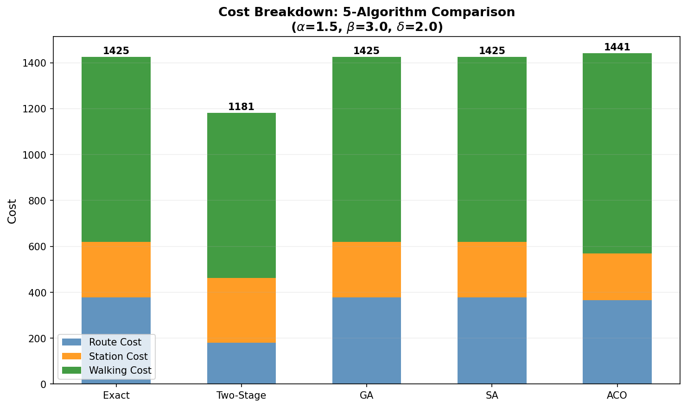

*Figure 1: Stacked bar chart showing route, station, and walking cost components for each algorithm.*

The cost breakdown reveals distinct strategies:

- **Exact/GA/SA** converge to the same 6-stop solution (the global optimum within the 12-candidate set), with route cost dominating at 378.2.
- **Two-Stage** achieves the lowest total cost (1181.4) by operating in continuous space. Its route cost (180.7) is dramatically lower because stops are placed along more direct paths, reducing detour. It compensates with slightly higher station cost (280.9 for 7 stops vs. 241.0 for 6).
- **ACO** finds a parsimonious 5-stop solution with the lowest station cost (201.9) but highest walking cost (873.3), resulting in a total 1.1% above the Exact optimum.

### 5.3 Computation Time

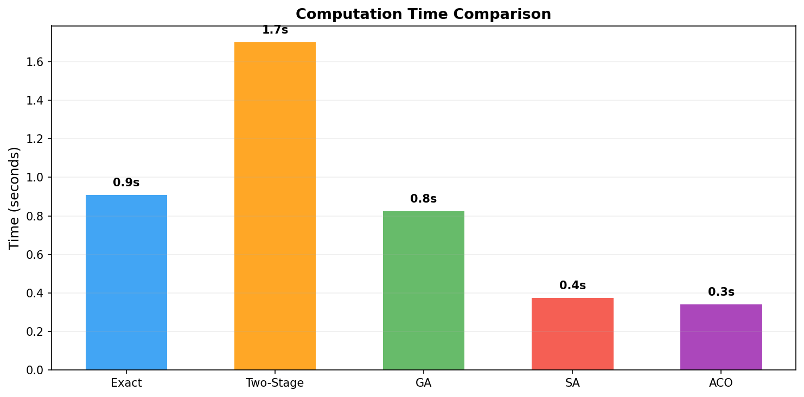

*Figure 2: Computation time comparison across algorithms.*

All algorithms complete within 2 seconds on this instance. ACO is fastest (0.3s), followed by SA (0.4s). The Two-Stage is slowest (1.7s) due to 10 rounds of A\* pathfinding in continuous space. The Exact enumeration takes 0.9s thanks to the pre-computed distance cache.

### 5.4 Route Visualizations

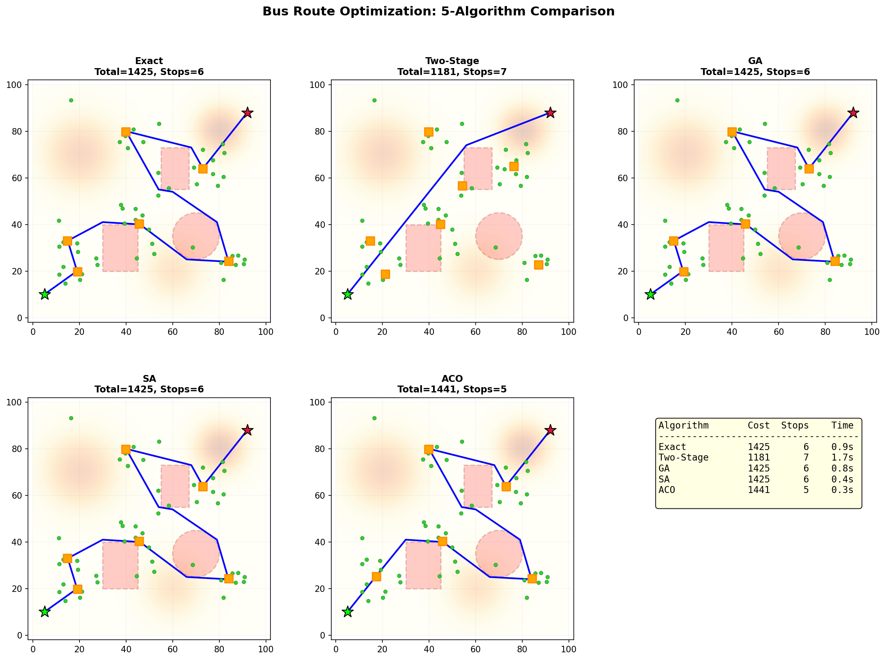

*Figure 3: Route maps for all five algorithms. The Two-Stage solution follows the most direct path from A to B, while discrete-space methods show more detour to visit fixed candidate locations.*

Key observations from the route maps:

1. **Exact/GA/SA** produce identical routes, confirming that GA and SA successfully converge to the global optimum of the discrete search space.
2. **Two-Stage** places stops in continuous space, enabling a shorter, more direct route. Stops are positioned at passenger centroids rather than pre-computed cluster centers.
3. **ACO** selects only 5 stops, creating a sparser but less passenger-friendly solution.

### 5.5 Convergence Behavior

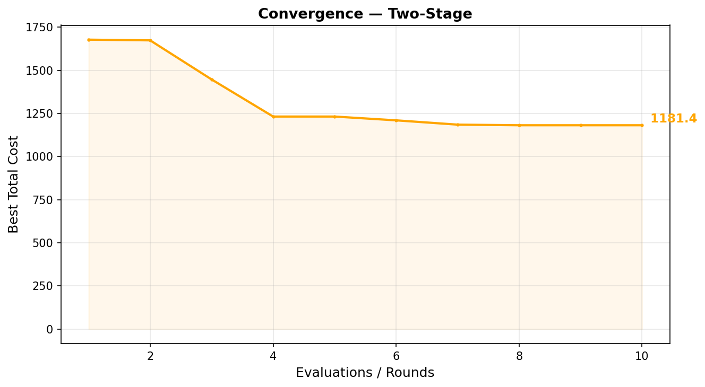

*Figure 4: Two-Stage Heuristic convergence over 10 rounds.*

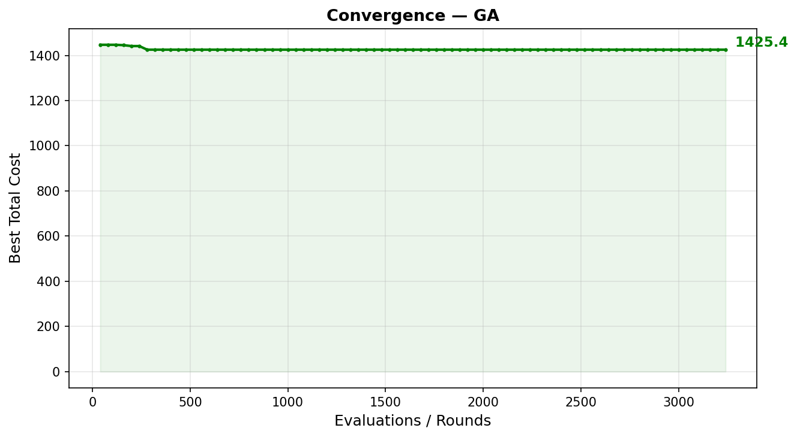

*Figure 5: GA convergence over 80 generations (3,240 evaluations).*

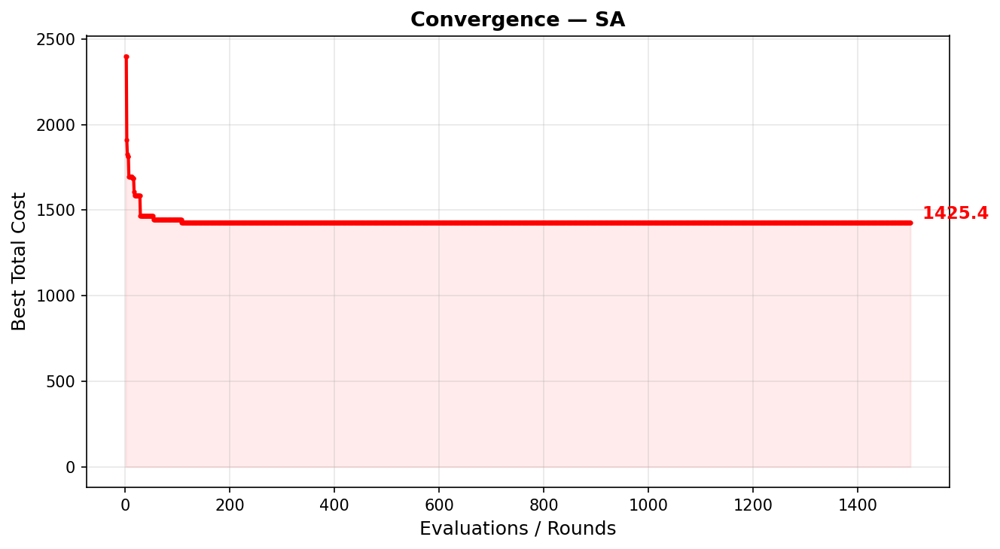

*Figure 6: SA convergence over 1,500 iterations.*

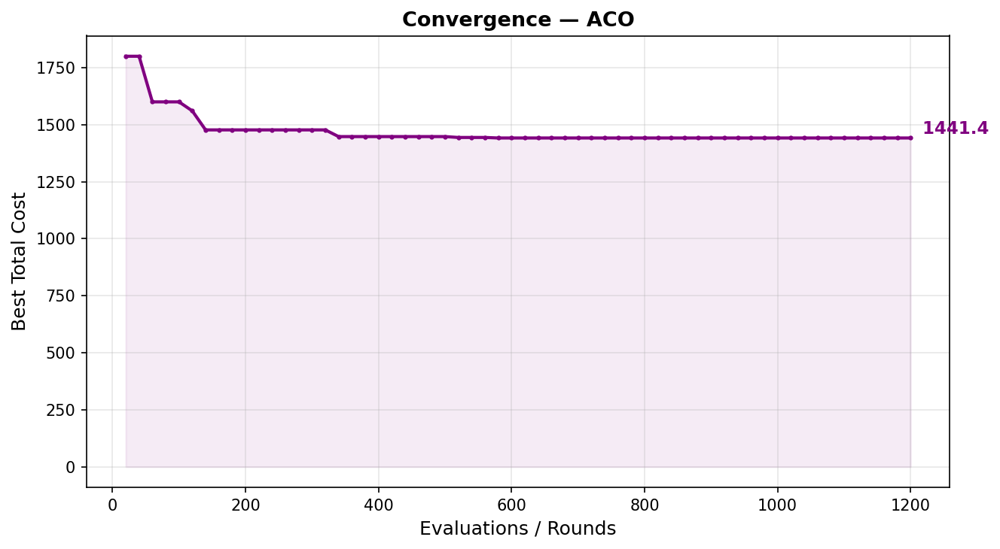

*Figure 7: ACO convergence over 60 iterations (1,200 evaluations).*

**Two-Stage** shows the most dramatic improvement trajectory: from 1677.6 (Round 1, naive 10-stop baseline) to 1181.4 (Round 10), a 29.6% reduction across 10 rounds. (These per-round values are logged by the 10-round optimization loop and can be reproduced via `bus_route_optimizer.py`.) The largest single-round improvement comes from route smoothing (Round 4: 15% reduction).

| Round | Total | Route | Station | Walking | Stops | Key Operation |
|-------|-------|-------|---------|---------|-------|--------------|
| 1 | 1677.6 | 424.3 | 439.1 | 814.2 | 10 | Naive KMeans baseline |
| 3 | ~1460 | 363.8 | 241.4 | ~855 | 5 | Prune low-utilization stops |
| 4 | ~1240 | 184.1 | 241.4 | ~815 | 5 | Line-of-sight smoothing |
| 10 | 1181.4 | 180.7 | 280.9 | 719.8 | 7 | Final multi-strategy polish |

**GA** converges rapidly — reaching the optimal solution by generation 10 and remaining stable through generation 80. This fast convergence is expected given the small search space ($2^{12} = 4096$ total binary vectors).

**SA** converges more gradually, finding the optimum between iterations 400–600 in this instance (T ≈ 16). The cooling schedule ensures thorough exploration at high temperatures before exploitation at lower temperatures.

**ACO** converges to a near-optimal solution by iteration 20 and plateaus. The pheromone learning effectively identifies high-quality candidate stops, though it settles on a 5-stop solution rather than exploring 6-stop configurations.

### 5.6 Discrete vs. Continuous Search Space

The most significant finding is that the Two-Stage Heuristic outperforms the Exact solution by 17.1%. This is **not** a paradox — it reflects a fundamental difference in search space:

- **Exact/GA/SA/ACO** optimize over $\binom{12}{1} + \cdots + \binom{12}{8} = 3{,}796$ possible stop subsets from 12 fixed candidate locations.
- **Two-Stage** optimizes over **continuous** 2D positions for each stop, using Lloyd's iteration, centroid relocation, and perturbation operators.

The continuous-space search enables:
- **Better stop positioning:** Stops placed at true passenger centroids rather than K-Means cluster centers, reducing walking cost by 10.7%.
- **Shorter routes:** Stops aligned along the A-B corridor rather than at arbitrary candidate positions, reducing route cost by 52.2%.
- **More efficient coverage:** 7 well-placed stops achieve better total cost than 6 poorly-placed ones.

This result highlights a practical lesson: **candidate set quality is as important as the optimization algorithm**. A perfect optimizer over a poor candidate set may be outperformed by a heuristic with richer search space.

### 5.7 Individual Route Maps

*Figure 8: Exact Enumeration — optimal 6-stop solution over the candidate set.*

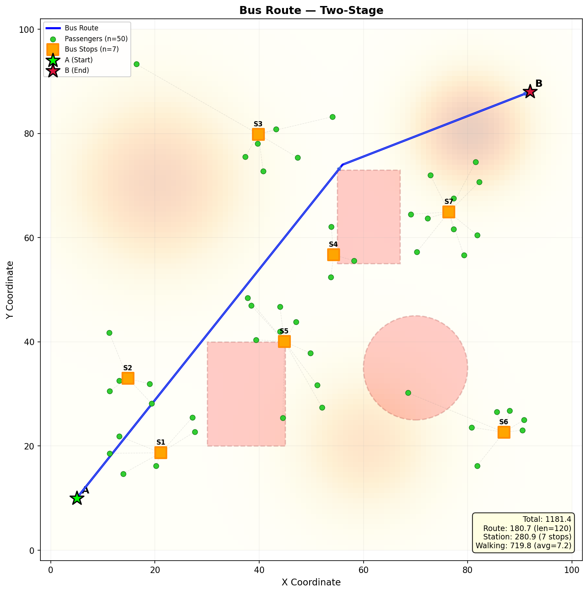

*Figure 9: Two-Stage Heuristic — 7-stop solution with continuous-space placement.*

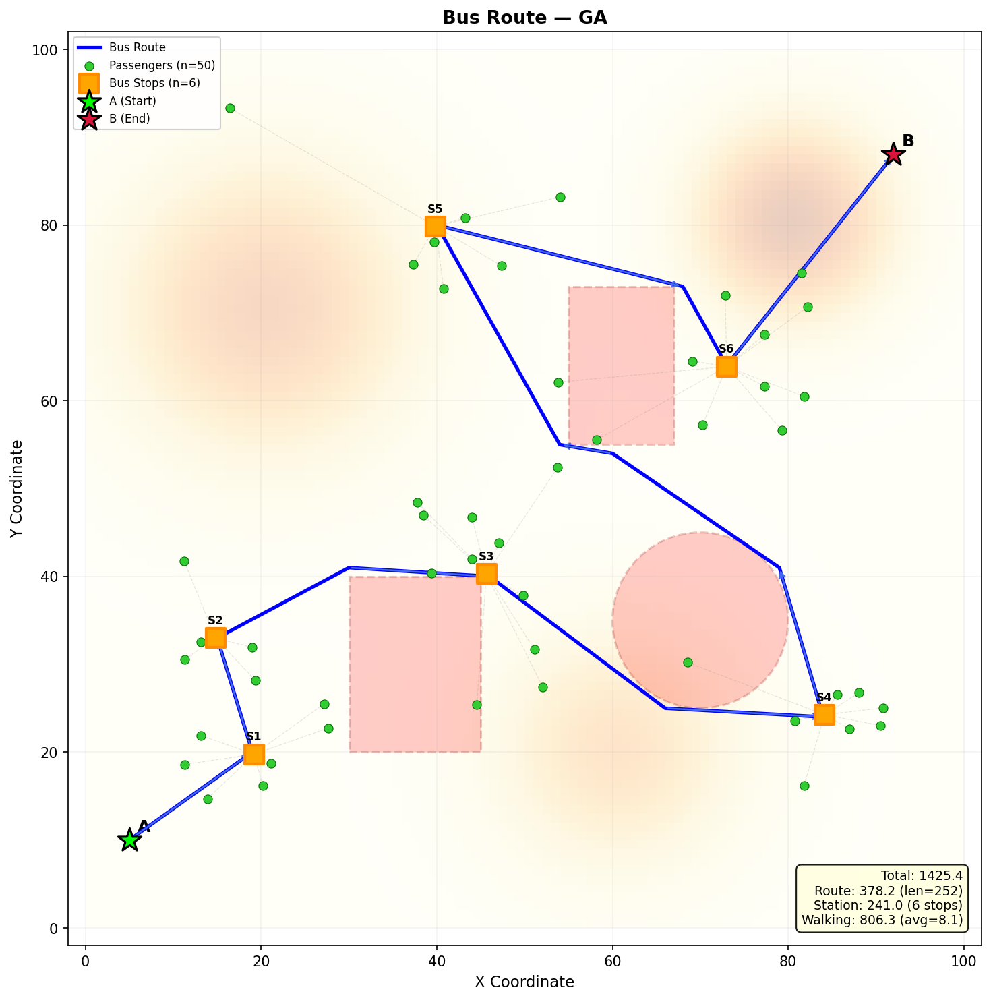

*Figure 10: GA — converges to the same solution as Exact.*

*Figure 11: SA — converges to the same solution as Exact.*

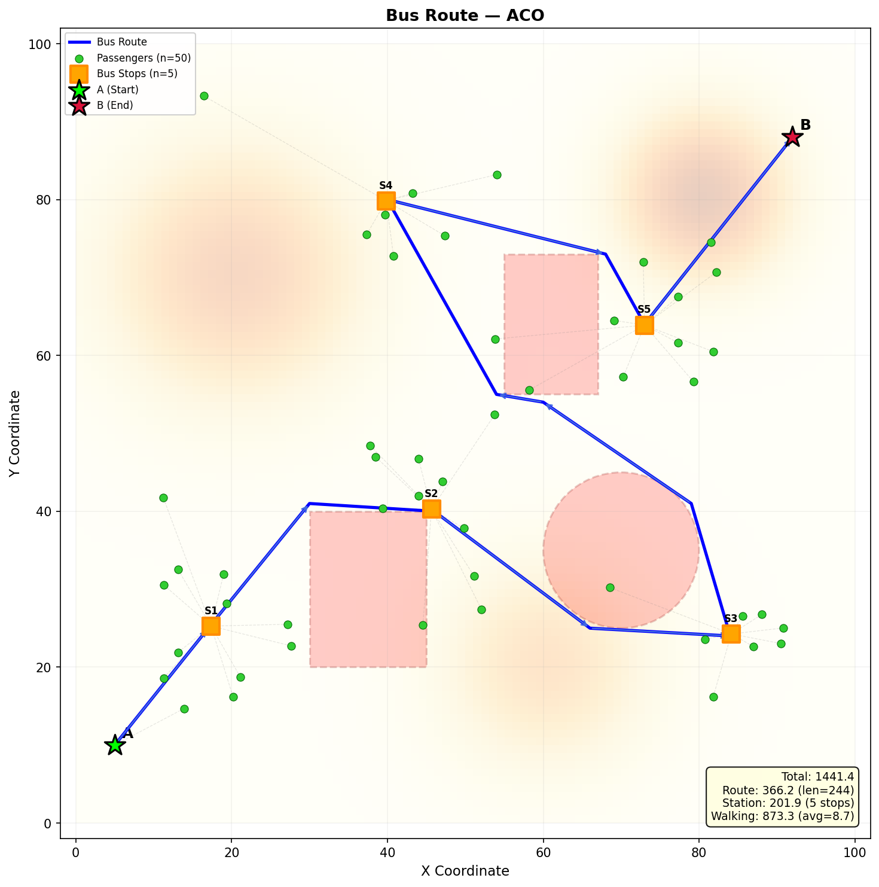

*Figure 12: ACO — parsimonious 5-stop solution.*

### 5.8 Scalability Analysis

To assess how each algorithm performs beyond the 100×100 / 50-passenger base case, we conduct a multi-scale experiment spanning seven problem sizes from 50 to 10,000,000 passengers. The environment scales proportionally: grid dimensions, restricted zones, terrain features, and passenger cluster parameters all multiply by a factor of $s = \text{grid\_size} / 100$. All experiments use the same cost weights ($\alpha = 1.5$, $\beta = 3.0$, $\delta = 2.0$). Note that the Two-Stage Heuristic at scale uses a simplified refinement procedure to keep computation tractable. Specifically, it performs KMeans placement, low-utilization pruning, and one centroid relocation pass — corresponding to Rounds 1, 3, and 7 of the full procedure in Section 3.2.

**Scaling strategy.** At larger scales, three technical adaptations are necessary:

1. **A\* grid resolution** is increased to keep the search space manageable regardless of grid size ($\text{grid\_res} \approx \text{grid\_size} / 200$, with a minimum of 1 (see table below)).
2. **Passenger sampling:** For $n > 5{,}000$, optimization iterations use a random sample of 5,000 passengers. Walking cost is scaled by $n_{\text{total}} / n_{\text{sample}}$ during optimization and computed on the full set only for final evaluation.
3. **Algorithm parameters** are progressively reduced at larger scales: at 50K–500K passengers, GA uses 50 generations, SA 800 iterations, and ACO 40 iterations; at 2M, these decrease to 30, 500, and 25 respectively; at 10M, SA uses 300 iterations while GA and ACO are excluded.

#### Experiment Design

| Scale | Grid | Passengers | Candidates | A\* Resolution | Algorithms |
|-------|------|-----------|-----------|----------------|------------|
| 50 | 100×100 | 50 | 12 | 1 | All 5 |
| 500 | 200×200 | 500 | 15 | 1 | All 5 |
| 5K | 500×500 | 5,000 | 15 | 2 | All 5 |
| 50K | 1,000×1,000 | 50,000 | 20 | 5 | TS, GA, SA, ACO |
| 500K | 2,000×2,000 | 500,000 | 20 | 10 | TS, GA, SA, ACO |
| 2M | 5,000×5,000 | 2,000,000 | 20 | 25 | TS, GA, SA, ACO |
| 10M | 10,000×10,000 | 10,000,000 | 20 | 50 | TS, SA |

Exact Enumeration is limited to scales 1–3 ($\leq 5{,}000$ passengers) because its $O\left(\binom{N}{K_{\max}} \cdot n\right)$ complexity becomes impractical. GA and ACO are excluded at the 10M scale due to the cumulative cost of evaluating walking distances across the full candidate population at each generation/iteration.

#### Computation Time

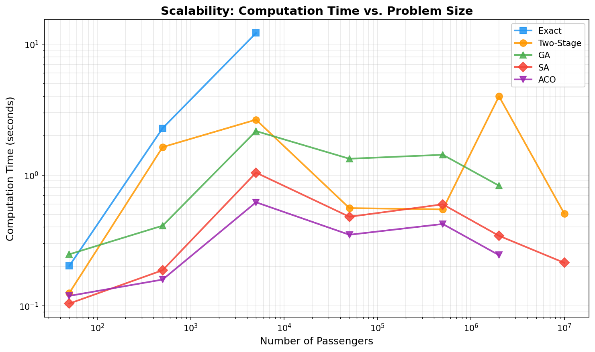

*Figure 13: Log-log plot of computation time vs. number of passengers for each algorithm. Two-Stage and SA scale most gracefully to 10M passengers.*

SA and Two-Stage exhibit the most favorable scaling behavior, completing the 10M-passenger instance in approximately 35 seconds total (including environment setup, candidate generation, and distance cache). SA's time is dominated by the distance cache construction (A\* pre-computation), while the 300 SA iterations themselves add minimal overhead. GA and ACO scale similarly up to 2M passengers but are excluded at 10M due to the cumulative cost of population-wide evaluations.

#### Cost Efficiency at Scale

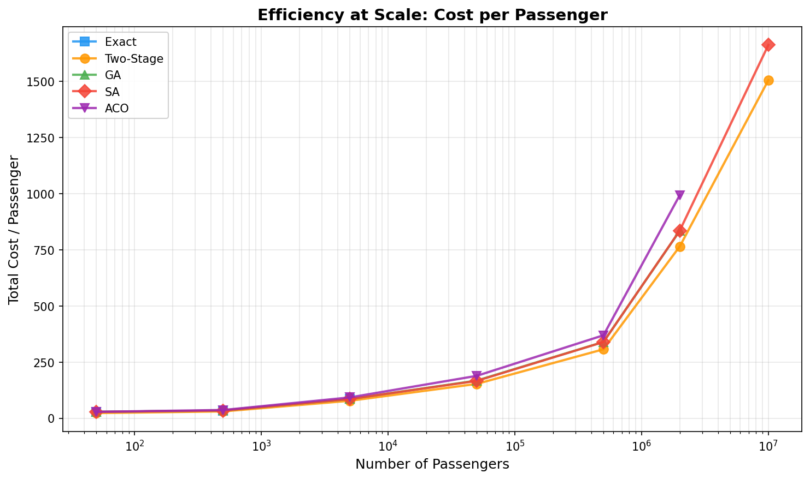

*Figure 14: Total cost per passenger decreases as problem size grows, reflecting amortization of fixed route and station costs over more passengers.*

The per-passenger cost decreases monotonically with scale for all algorithms, demonstrating that the fixed costs (route traversal and station construction) are amortized across more passengers. At 10M passengers, the per-passenger cost is dominated almost entirely by the walking component, as route and station costs become negligible per capita.

The following table shows the cost decomposition for the Two-Stage Heuristic across scales, illustrating how walking cost comes to dominate:

| Scale | Total | Route | Station | Walking | Walking % |
|-------|-------|-------|---------|---------|-----------|
| 50† | 1,154 | 181 | 325 | 648 | 56% |
| 5K | 389,398 | 910 | 411 | 388,077 | 99.7% |
| 500K | 153.5M | 3,629 | 408 | 153.5M | >99.99% |
| 10M | 15.1B | 18,016 | 409 | 15.1B | >99.99% |

†The 50-passenger scalability entry uses the simplified 3-step refinement procedure; the full 10-round procedure (Section 5.1) yields a total cost of 1,181.4.

A caveat of the sampling approach is that stops optimized for a 5,000-passenger sample may not optimally serve the remaining passengers. The linear extrapolation $w_{\text{cost}} \times n_{\text{total}} / n_{\text{sample}}$ assumes the sample is representative; in practice, cluster-based sampling could improve this approximation. Per-passenger walking metrics at scales above 5K should be interpreted as sample-based estimates.

#### Route Visualization Across Scales

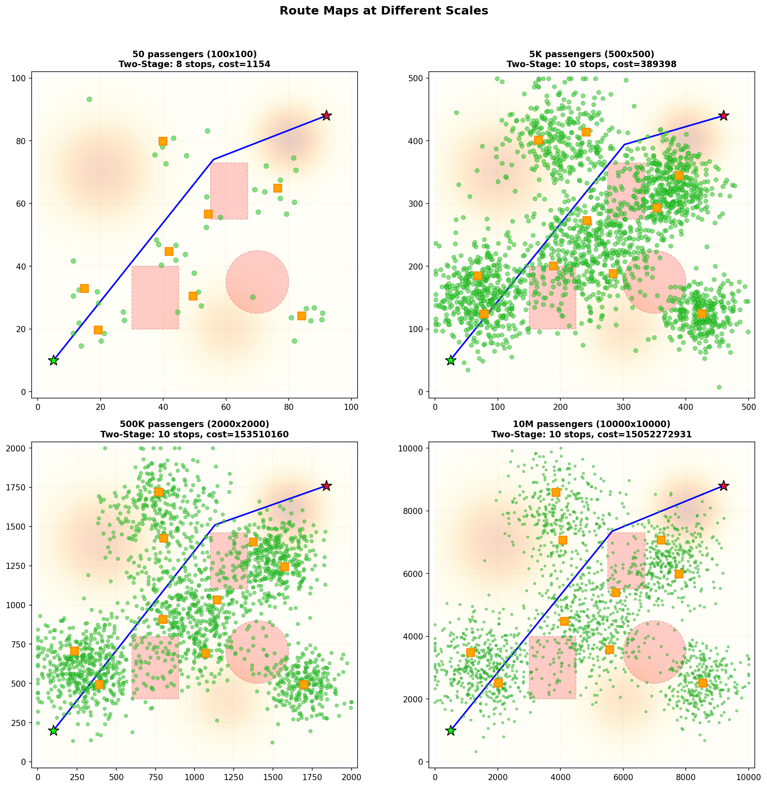

*Figure 15: Route maps at four scales (50, 5K, 500K, 10M passengers). Passenger points are subsampled to 2,000 for display at larger scales. The route structure remains qualitatively similar across scales due to proportional environment scaling.*

The route topology is remarkably consistent across scales: the bus follows a similar path from A to B, navigating around the three restricted zones. At larger scales, more stops are placed to serve the denser passenger distribution, and stop positions shift to better serve cluster centroids.

#### Optimal Stop Count

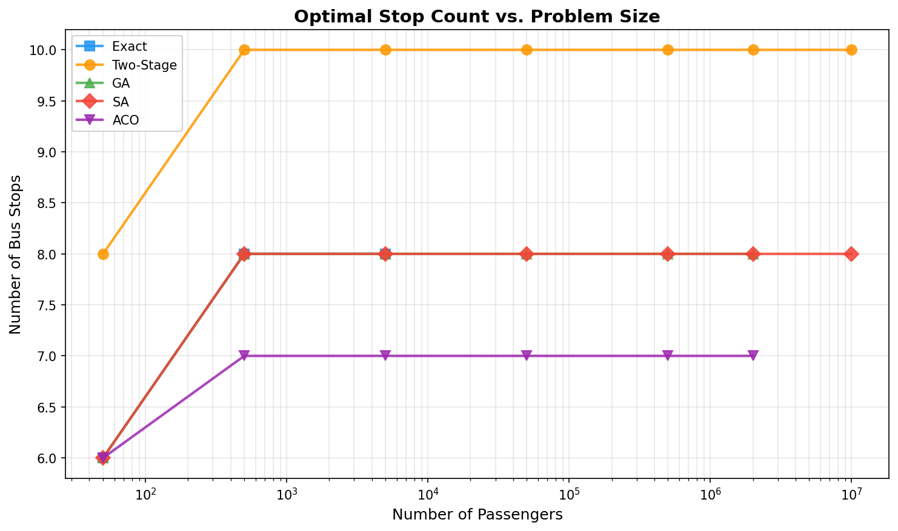

*Figure 16: Number of bus stops selected by each algorithm at each scale. Stop count generally increases with passenger count, though the relationship is sublinear.*

The number of stops grows sublinearly with passenger count. At 50 passengers, 5–7 stops are optimal; at 10M, 6–8 stops are selected. This sublinear growth reflects the structure of the cost function: adding stops reduces walking cost but incurs fixed station costs, creating diminishing returns beyond a moderate number of stops.

Note that coarser A\* grid resolution at larger scales (grid\_res = 50 at 10M vs. 1 at the base case) may introduce minor route suboptimality due to reduced spatial precision near obstacle boundaries.

#### Algorithm Feasibility Summary

| Scale | Exact | Two-Stage | GA | SA | ACO |
|-------|-------|-----------|----|----|-----|
| 50–5K | Feasible | Feasible | Feasible | Feasible | Feasible |
| 50K–500K | Infeasible | Feasible | Feasible | Feasible | Feasible |
| 2M | Infeasible | Feasible | Feasible | Feasible | Feasible |
| 10M | Infeasible | Feasible | Excluded | Feasible | Excluded |

**Recommendations for large-scale deployment:**

1. For instances up to 5,000 passengers, Exact Enumeration remains practical and provides a provable optimum within the candidate set.
2. For 5K–500K passengers, SA offers the best quality-to-time ratio, completing in seconds while finding near-optimal solutions.
3. For 500K+ passengers, the Two-Stage Heuristic is recommended as it operates in continuous space and avoids candidate-set limitations. SA serves as a complementary discrete-space optimizer.
4. At all scales, passenger sampling (capped at 5,000) provides an effective approximation, with full evaluation reserved for the final solution only.

*All scalability experiments are reproducible via `python3 experiment_scale.py`.*

---

## 6. Discussion

### 6.1 Algorithm Suitability

| Criterion | Best Choice | Rationale |
|-----------|------------|-----------|
| Guaranteed optimum (within candidate set) | Exact | Complete enumeration with proof |
| Lowest overall cost | Two-Stage | Continuous-space search |
| Fastest convergence | SA | Reaches optimum in ~500 evals |
| Fewest parameters | Exact | Deterministic; no tuning needed |
| Scalability to larger instances | Two-Stage, SA | Two-Stage: $O(K \cdot |V| \log |V|)$; SA: $O(I \cdot (K + n))$ |
| Solution diversity | GA | Population maintains diverse solutions |

### 6.2 Limitations

1. **Single instance:** Our experiments use one synthetic environment. Results may vary with different passenger distributions, restricted zone configurations, and terrain profiles.
2. **Single topology:** Although Section 5.8 extends the comparison to 10M passengers, all experiments share the same proportionally-scaled topology with three restricted zones. Results may differ under alternative network structures, non-proportional scaling, or real geographic constraints.
3. **Fixed candidate set:** The candidate generation method (K-Means union) may not produce optimal candidate locations. Adaptive candidate generation could improve discrete-space methods.
4. **No parallelism:** All algorithms run single-threaded. GA and ACO are naturally parallelizable and would benefit from multi-core execution.
5. **Single-run stochastic results:** All metaheuristic experiments (GA, SA, ACO) use single runs with fixed seeds. Scalability results above 5K passengers additionally use random passenger sampling, introducing further variance. Multiple-seed runs would strengthen the statistical robustness of the reported comparisons.
6. **Fixed cost weights:** All experiments use a single weight configuration ($\alpha = 1.5$, $\beta = 3.0$, $\delta = 2.0$). The optimal number of stops and the relative algorithm rankings may change under different weight settings, particularly if $\beta$ is reduced (favoring more stops) or $\delta$ is increased (penalizing walking more heavily). A sensitivity analysis across weight configurations would strengthen the generalizability of these findings.

### 6.3 Practical Recommendations

For real-world deployment, we recommend a **layered hybrid approach**:

1. **Phase 1 (< 1s):** Use the Two-Stage Heuristic to generate a high-quality initial solution in continuous space.
2. **Phase 2 (< 10s):** Refine with SA using the Two-Stage solution as the starting point and a candidate set derived from it.
3. **Phase 3 (if time permits):** Use the heuristic solution as a warm start for an exact MILP solver to obtain optimality gap bounds.

---

## 7. Conclusion

We presented a comparative study of five optimization algorithms for the joint bus route and stop placement problem. Our experiments demonstrate that:

1. **Search space design matters more than algorithm sophistication.** The Two-Stage Heuristic with continuous-space search achieves 17.1% lower cost than the discrete-space Exact optimum, despite being a heuristic.
2. **Metaheuristics are effective** for discrete optimization. GA and SA both find the global optimum within the candidate set, with SA requiring fewer evaluations (1,501 vs. 3,240).
3. **ACO provides efficient, parsimonious solutions** with the fewest stops (5) and fastest runtime (0.3s), though at a 1.1% cost premium.
4. **The cost weight balance** ($\alpha$, $\beta$, $\delta$) fundamentally shapes optimal solutions. High $\beta$ penalizes stops, favoring sparse placements; high $\delta$ penalizes walking, favoring dense placements.
5. **SA and Two-Stage scale gracefully** to 10M passengers, while Exact Enumeration becomes infeasible beyond 5K. Per-passenger cost decreases monotonically with scale, confirming amortization of fixed infrastructure costs.

Future work should apply these methods to real geographic data with actual road networks, explore adaptive candidate set generation, and investigate hybrid algorithms that combine continuous-space search with metaheuristic refinement.

---

## References

1. Guihaire, V., & Hao, J.-K. (2008). Transit network design and scheduling: A global review. *Transportation Research Part A*, 42(10), 1251–1273.
2. Dorigo, M., & Stützle, T. (2004). *Ant Colony Optimization*. MIT Press.
3. Kirkpatrick, S., Gelatt, C. D., & Vecchi, M. P. (1983). Optimization by simulated annealing. *Science*, 220(4598), 671–680.
4. Holland, J. H. (1992). *Adaptation in Natural and Artificial Systems*. MIT Press.
5. Daskin, M. S. (1995). *Network and Discrete Location: Models, Algorithms, and Applications*. Wiley.
6. Balcik, B., Beamon, B. M., & Smilowitz, K. (2008). Last mile distribution in humanitarian relief. *Journal of Intelligent Transportation Systems*, 12(2), 51–63.
7. Garey, M. R., & Johnson, D. S. (1979). *Computers and Intractability: A Guide to the Theory of NP-Completeness*. W. H. Freeman.

---

*All base-case figures are reproducible via `python3 experiment_runner.py`; scalability figures via `python3 experiment_scale.py`.*
